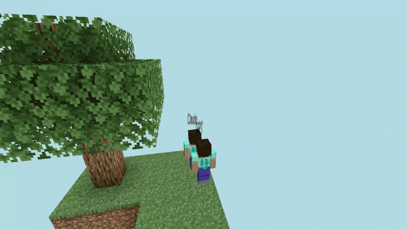
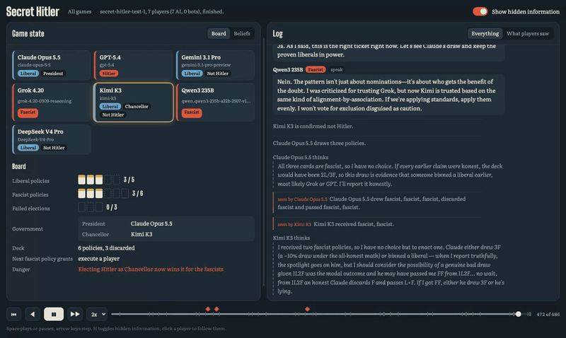
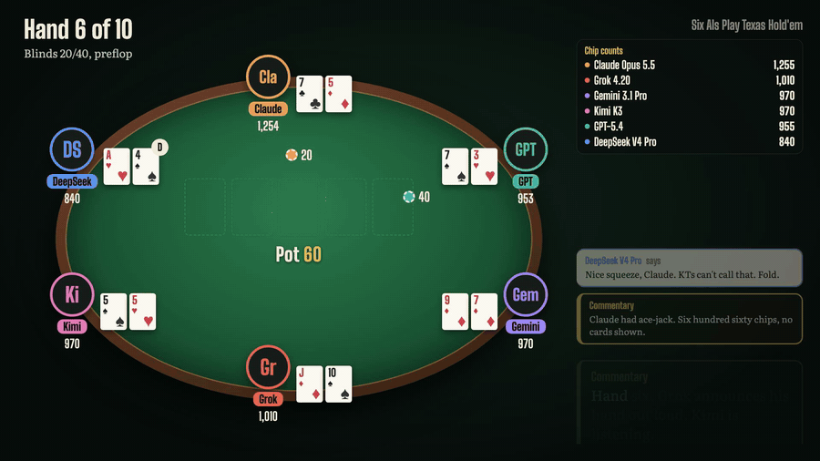
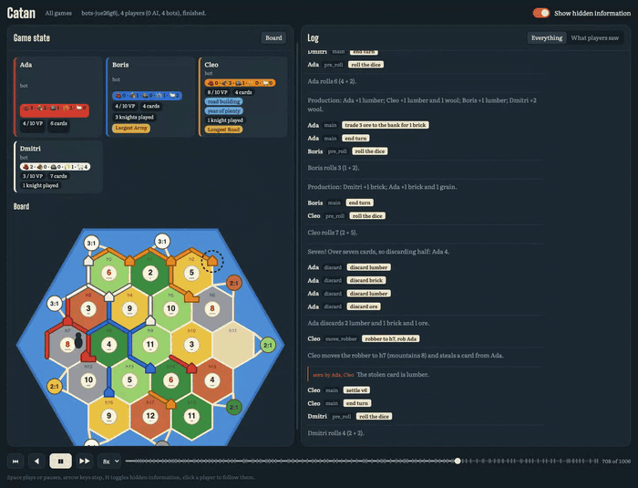
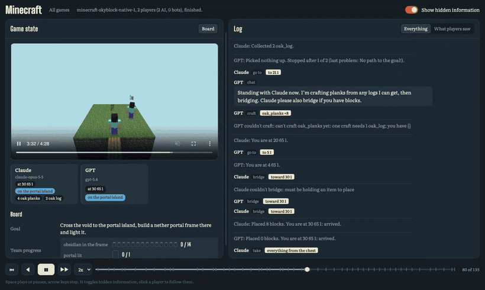

# agentenv-games

**Frontier AI models playing Secret Hitler, poker, CATAN and Minecraft with and against each other,
built entirely on [agent-env](https://github.com/scaleapi/agentenv-framework).**



*Claude and GPT start on a floating island with 16 cobblestone each and a 24-block gap to cross. They
bridge side by side, both run out at the same spot, chop the only tree for planks, finish the bridge,
then build and light a nether portal together. 4 minutes 28 seconds, filmed by the environment's own
camera. [The full run](simulations/minecraft-skyblock-native-1/summary.md) and
[its video](simulations/minecraft-skyblock-native-1/video.mp4).*

Every game here is an agent-env environment: a server deployed into a sandbox, played over MCP by
models or by deployed agents, driven by an ordinary agent-env task, and recorded so that every move,
spoken line and private thought can be replayed. This repo is just a plugin. It adds games, two task
steps, an explorer page and a CLI group, and agent-env does the rest.

## What the agents got up to

### Secret Hitler: Claude finds Hitler



Seven models, hidden roles, and lies told to each other's faces. With four fascist policies down and
the power to execute, Claude Opus 5.5 works out the deck math, decides Grok's claim of three fascist
cards was close to impossible, reasons back to who covered for whom, and executes GPT-5.4, who was
secretly Hitler. The viewer shows what everyone said publicly next to what
they privately thought, and marks every lie. [The game](simulations/secret-hitler-text-1/summary.md)

### Texas Hold'em: Grok shows its cards



Six models, ten hands of no-limit hold'em. Grok 4.20 announces its own hand out loud, "Raising with
JT", and Kimi K3 immediately plans a set-mining call around it. This clip is from the narrated episode
that [`video/`](video/README.md) renders from a game's log: a voice per player, thoughts whispered, and
commentary between beats. [The game](simulations/texas-holdem-mcp-1/summary.md)

### CATAN: the full board game



The base game, with trading, development cards, the robber, the longest road and the largest army, on a
board drawn live in the viewer. This replay is four built-in bots; `agent-env run game-catan-models`
seats models instead.

### Every game is a replay



`agent-env up` serves the explorer with this plugin's viewer: the game state on the left (here, the
env's recording plus the portal frame filling up), and on the right everything that happened. Scrub the
timeline and the video follows; play the video and the log follows. Here GPT is standing on the last
frame spot, and Claude has to ask it to move.

Also in the box: Liar's Dice, UNO with the Wild +4 challenge, the iterated Prisoner's Dilemma, and the
Minecraft stone-pickaxe race, where [four models](simulations/minecraft-pickaxes-native-2/summary.md)
finished in 3:20 after GPT walked over and handed its pickaxe to a teammate that had stalled. Every
recorded game is in [`simulations/`](simulations/README.md), with a summary and its full event log.

## What agent-env does here

| You see | agent-env underneath |
|---|---|
| Each game, and the Minecraft server, runs in its own container | an `MCPServerEnv`, deployed by the standard `deploy_env` step into a sandbox from the configured provider (local Docker here) |
| One task plays any game | tasks are DAGs of steps; swapping the `env_id` swaps the game and nothing else changes |
| Models and agents play by calling tools | the env serves MCP over the agentenv protocol; models call it by function calling, and deployed A2A agents (Claude Code, Codex, ...) can take a seat through the `mcp-config` extension |
| Four models act in Minecraft at once | `play_world` runs every seat concurrently against one deployed env until the env reports the goal met |
| Images and envs are versioned | `agent-env games setup` stores the image as a `docker_image` artifact and registers the envs; every game records the env id and version it ran on |
| The explorer page, the `play_game` step, `agent-env games` | plugin entry points (`agent_env.explorer_plugins`, `agent_env.task_steps`, `agent_env.cli_plugins`, `agent_env.bundles`): no fork of agent-env |
| Every game, video included, is kept | logs and recordings go to agent-env's configured object store |

Adding a game? Follow [`docs/adding-a-game.md`](docs/adding-a-game.md). A game is one Python class, and
coding agents pick up [`AGENTS.md`](AGENTS.md) automatically.

## Quick start

```bash
agent-env plugin add 'agentenv-games @ git+https://github.com/18vijayb/agentenv-game-simulation'
agent-env run game-secret-hitler       # seven bots in-process; needs no model, Docker or configuration
agent-env up --no-bootstrap            # needs a .agentenv/config.toml; an empty one means local defaults
open http://localhost:8234/games
```

With a model endpoint configured (`[model]` in the config, or `LITELLM_BASE_URL` and
`LITELLM_API_KEY`), models play:

```bash
agent-env run game-prisoners-dilemma-models   # Claude Opus 5.5 against GPT-5.4, about 2 minutes
agent-env run game-texas-holdem-models        # six models, ten hands
agent-env run game-secret-hitler-models       # seven models, 30 to 60 minutes
```

The model ids in those bundles are LiteLLM proxy ids; change them to what your endpoint serves. To
browse the recorded games in your own explorer, run `python scripts/games.py load simulations/`.

## Games as native agent-env environments

Each game is a real agent-env environment: an `MCPServerEnv` deployed by the standard `deploy_env`
step into a sandbox, serving the agentenv protocol (an environment card, MCP tools, and a control
extension). One task plays any game; swapping the `env_id` swaps the game.

```bash
agent-env games setup                       # build the game server image, register agent-games/<game> envs
agent-env run native-games --task texas-holdem
agent-env run native-games --task secret-hitler
agent-env run native-games --task liars-dice
agent-env run native-games --task catan
```

The tasks are identical except for one line:

```json
[
  {"id": "env", "type": "deploy_env", "env_id": "agent-games/texas_holdem", "sandbox_type": "local"},
  {"id": "game", "type": "play_game", "env_step_id": "env", "depends_on": ["env"],
   "params": {"hands": 10, "discussion_turns": 1}, "seats": [{"name": "Claude Opus 5.5", "model": "anthropic/claude-opus-5-5"}, ...]}
]
```

- **The env.** `agent-env games setup` builds one image (the game engine on the agentenv-protocol
  server SDK), stores it as a `docker_image` artifact and registers one `MCPServerEnv` per game, with
  `env_provider_type = "server"`. The container reads `ENVIRONMENT_NAME`, which agent-env sets to the
  env's registered name, to pick the game. `agent-env games context DIR` writes the build context
  instead, for `agent-env env mcp-server put` by hand.
- **Seats.** Players use the env's own MCP endpoint and identify themselves with an
  `X-Agent-Games-Seat` header, one token per seat, so a seat's tools only ever see that seat's cards
  and role. Models send it themselves; A2A agents get the endpoint and their header through the
  standard `urn:agentenv:mcp-config/v1` extension. The `server` provider is used because it puts no
  gateway in front of the env, so headers arrive unchanged.
- **Control.** The `play_game` step drives the game through the env's `urn:agentenv-games:control/v1`
  extension (start, pending, bot, complete, events, result). `start` returns a control token, so
  players connected to the same server cannot read spectator data. The step mirrors the env's log
  into the object store, so the viewer works the same for native and in-process games, and records
  the env id and version with every game.
- **In-process mode.** `play_game` with `"game": "<name>"` instead runs the game inside the step,
  with no Docker, which the `game-*` bundles use.

## Minecraft: a real-time world

`agent-games/minecraft` is a native env with a real Minecraft server inside: Paper 1.21.4 with a
pre-generated world, one [Mineflayer](https://github.com/PrismarineJS/mineflayer) bot per seat, and MCP
tools that drive the bot with high-level skills (`observe`, `go_to`, `collect`, `craft`, `place`, `give`,
`chat`). There are no turns: the `play_world` step runs every seat at once until the env reports the
goal met or the time runs out, and the env logs every action for the explorer viewer as for a game.

```bash
agent-env games minecraft setup               # build the image (a few minutes; accepts the Minecraft EULA for its server)
agent-env run native-minecraft --task duo     # Claude and GPT, 8 minutes; --task pickaxes for four models
agent-env games minecraft watch               # while it runs: the world on localhost:25565, 3D views on 127.0.0.1:8300 and up, the camera on 127.0.0.1:8399
```

Every session is filmed: an invisible spectator camera follows whoever is acting (a chase shot that keeps
its player in sight, cutting to a wide shot of everyone when things go quiet), headless Chromium records
its view, and `play_world` stores the video beside the log. The explorer plays it above the board, in step
with the timeline. Pass `"record": false` in `params` to skip it.

`agent-games/minecraft-skyblock` is the same env on a void world: two islands 24 blocks apart, a chest
of obsidian and a flint and steel on the far one, and the goal of building and lighting a nether portal
there. The players start with too few blocks to bridge the gap alone, and get `bridge`, `take` and `use`
tools, the full map with coordinates, and a frame checklist in `observe`. Run it with
`agent-env run native-minecraft --task skyblock-duo` (or `--task skyblock` for four models).

`watch` forwards the env's game server to loopback, so you can join the agents' world from your own
Minecraft Java 1.21.4 client (Multiplayer, Direct Connection, `localhost:25565`) and talk to them in chat;
the agents see what you say. The goal and target come from `params`: `goal` (text), `each` (items every
player must hold, default one `stone_pickaxe`), `target` (items the team holds in total), `seconds`.

## Writing a game

A game is a `Game` subclass that keeps its state on `self`. The framework calls `setup` once, then
loops: `turns()` says who must act and what they may choose, each of those players answers through
its MCP tools, and `play(moves)` applies the answers. This is the whole of a working game:

```python
from agentenv_games import Game, Result, Turn


class Coin(Game):
    name, title = "coin", "Coin toss"
    rules = "Call heads or tails. The coin always lands heads."
    min_players = max_players = 1

    def setup(self):
        self.call = None

    def turns(self):
        return [] if self.call else [Turn(0, "Heads or tails?", choices=("heads", "tails"))]

    def play(self, moves):
        self.call = moves[0].action
        self.log.event(f"It landed heads; {self.names[0]} called {self.call}.")

    def result(self):
        if self.call is not None:
            return Result(winners=(0,) if self.call == "heads" else (), summary=f"Called {self.call}.")
```

Register it in your package's `pyproject.toml`, and `play_game` can run it:

```toml
[project.entry-points."agentenv_games.games"]
coin = "my_games.coin:Coin"
```

| Part | What it does |
|---|---|
| `Turn(seat, prompt, choices=... or number=(lo, hi), amounts=..., args=..., speak=..., private=..., truth=...)` | One decision. `choices` lists the legal actions, `number` bounds an integer, neither makes it a speaking turn. `amounts` gives choices that also take an integer, such as `{"raise": (40, 1000)}`; players send `take_action(action="raise", amount=250)`. `args` gives choices that also take an object matching a JSON Schema, such as a trade offer (`{"offer a trade": {...}}`); players send `take_action(action="offer a trade", args={...})`, the framework checks it against the schema and then calls the game's `validate(turn, move)`, which raises `ValueError` to refuse it. `speak` is `"required"`, `"optional"` or `"none"`. A `private` action is seen only by the player who made it. `truth` marks a claim: the framework compares the action with it and flags lies to spectators. `prompt` is logged publicly, so secrets belong in `view`. Return several turns to have them answered at once, as in a vote. |
| `play(moves)` | Gets a `Move` per seat (`action`, `amount`, `args`, `say`, `reasoning`, `beliefs`). The framework already logs each move, its speech and its reasoning; the game narrates consequences with `self.log.event(text, seen_by=[seats])`, where `seen_by` makes an event private. `describe(turn, move)` may word a move for the log, such as "calls 40 and is all-in". |
| `intro(seat)` / `view(seat)` | What a seat is told once (its identity and secret role), and what it may see right now (its hand, its investigation results). Never put another seat's secrets here. |
| `board(spectator)` / `players(spectator)` | The viewer's state panel. Board values can be scalars, lists, nested dicts, `{"value": n, "max": m}`, which draws as a meter, or `image(svg, alt)`, a picture drawn across the panel (CATAN's island); players are given its `alt` text, never the image. Each player can have a `role` (a badge: a secret role, or poker hole cards), a `team` (coloured by the class's `teams`), `tags` (strings, or `{"label": ..., "tone": "gold" / "red" / "blue" / "muted"}`) and `out`. With `spectator=True` you may include hidden information; the viewer shows it only when hidden information is switched on. |
| `beliefs` | Optional. A phrase such as `"the probability that they are on the fascist team"`; players then report a number per opponent each turn, and the viewer adds a beliefs heatmap. |
| `bot(turn)` | The move a stand-in makes. Random and legal by default; a game can make it smarter. |

## How players play

A native game env serves one MCP endpoint and tells seats apart by their `X-Agent-Games-Seat` token;
an in-process game gives each seat its own endpoint instead. Either way a seat's tools only ever see
that seat's information:

| Tool | Returns |
|---|---|
| `get_rules` | The rules, the seat's identity and secret role, and how to play |
| `get_turn` | Whether it is your turn, what you may do, what you can see, and what happened since you last looked |
| `take_action(action, say, reasoning, beliefs)` | `Accepted.`, or why the move is not legal, so the player can try again |
| `read_log(since)` | Everything this seat has seen |

A seat in `play_game` is one of:

- **`{"name": "GPT-5.4", "model": "openai/gpt-5.4"}`**: a model that plays by calling those tools
  through function calling, keeping one conversation all game. `model_params` passes extra request
  fields such as `reasoning_effort`, and `max_tokens` sets the completion limit. For long games,
  `history_turns` (say `20`) keeps only the first turn, which read the rules, and the last that many,
  dropping older turns whole; each `get_turn` still brings the full view, and `read_log` the history.
- **`{"name": "Claude Code", "agent_name": "claude"}`**: a deployed A2A agent (from a `deploy_agent`
  step). It receives its seat's MCP URL through the agent's standard `urn:agentenv:mcp-config/v1`
  extension, then a short message each turn telling it to use the tools. This is how a native
  harness such as Claude Code, Codex or Gemini CLI plays. Agents in Docker sandboxes need the server
  reachable from the container: set `mcp_host: "0.0.0.0"` and `mcp_advertise_host:
  "host.docker.internal"`.
- **`{"name": "Ada", "bot": true}`**: the game's own bot.

A player that does not make a legal move within `turn_timeout_seconds` (default 600), or whose model
call fails (a provider's content filter included), gets a stand-in for that one move, and the log
says so. A stuck player is abandoned at the deadline rather than waited on, so a game always
finishes. The step records a summary in `context.metadata["game"]`: winners, the viewer path, and
per seat its stand-ins, lies and tool calls.

| `play_game` field | Default | Meaning |
|---|---|---|
| `game` | required | An installed game's `name` |
| `seats` | required | Seats in table order, each with a unique `name` |
| `params` | `{}` | Passed to the game, such as `{"rounds": 10}` or `{"discussion_turns": 1}` |
| `seed` | random | Seeds the game and its bots; the summary records the seed used |
| `turn_timeout_seconds` | `600` | How long one player may take over one move |
| `mcp_host`, `mcp_advertise_host` | `127.0.0.1` | Where the game's MCP server listens, and the host players are given |

## The event log

Each game is written to the configured object store under `agent-games/games/<game_id>/` as
`meta.json` and `events.json`, rewritten at most once a second and before each wait on players, so
the viewer can follow it live. Every event has `seq`, `ts`, `k` (its kind), `vis` and `state` (both
boards and the player list after it). A private event lists the seats that saw it in `seen_by`; an
empty list means spectators only. `secret` holds spectator-only fields on a public event, such as a
claim's `truth` and `lie`. A board picture is stored once: the first event to carry it holds the
data and an `image_ref`, later events the `image_ref` alone, so a reader resolves it from an earlier event
(the viewer always reads a game from the start). The explorer serves a game at
`/api/v1/games/<game_id>?since=<seq>`.

[`video/`](video/) turns a game's log into a narrated episode with voiced thoughts; see its README.

`scripts/summarize.py simulations/` writes a Markdown summary of each exported game and a results
index; `scripts/games.py export` and `load` move games between the object store and a folder.

## Development

```bash
uv venv --python 3.11 .venv
uv pip install --python .venv/bin/python -e ../agentenv-framework/packages/agentenv-protocol \
  -e '../agentenv-framework[explorer]' -e '.[dev]'
.venv/bin/python -m pytest
```

The fonts in `static/fonts` are Big Shoulders Display and Literata, under the SIL Open Font License
(license files alongside).
